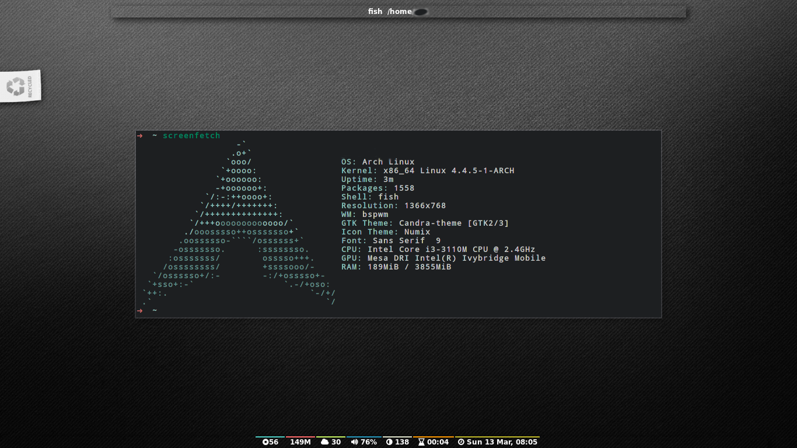

# Yabar

A modern and lightweight status bar for X window managers.

## Screenshots

## Description

Yabar is a modern and lightweight status bar that is intended to be used along with minimal X window managers like `bspwm` and `i3`. Yabar has the following features:

* Extremely configurable with easy configuration system using a single config file.
* A growing set of ready-to-use internal blocks developed in plain c.
* Pango font rendering with support of pango markup language.
* Support for icons and images.
* Support for transparency.
* Multi-monitor support using RandR.
* Entirely clickable.
* Support for several environment variables to help button commands.
* Multiple bars within the same session.

**Warning**: Yabar is still in its infancy and far from being mature. Feel free to contribute or report bugs!

## Terminology

A Yabar session should contain one or more *bars* within the same session. Each bar should contain one or more *blocks*. Each block should display some useful info to the user (free memory, CPU temperature, etc...).

## Installation

### Packages

#### ArchLinux

AUR: [yabar](https://aur.archlinux.org/packages/yabar/) and [yabar-git](https://aur.archlinux.org/packages/yabar-git/)

#### Debian

[yabar](https://packages.debian.org/search?keywords=yabar) in [Testing (Stretch)](https://packages.debian.org/stretch/yabar) and [Unstable (Sid)](https://packages.debian.org/sid/yabar)

#### Ubuntu

[yabar](http://packages.ubuntu.com/search?keywords=yabar&searchon=names&suite=all&section=all) in [Yakkety Yak](http://packages.ubuntu.com/yakkety/yabar)

### From Source
Yabar initially requires libconfig, cairo and pango. The feature `DYA_INTERNAL_EWMH` in `Makefile` additionaly xcb-ewmh (or xcb-util-wm in some distros) and the feature `-DYA_ICON` requires gdk-pixbuf2. These dependencies can be installed through your distribution's package manager:

* Fedora: `dnf install libconfig-devel cairo-devel pango-devel gdk-pixbuf2-devel`
* Debian / Ubuntu: `apt-get install libcairo2-dev libpango1.0-dev libconfig-dev libxcb-randr0-dev libxcb-ewmh-dev libgdk-pixbuf2.0-dev`

You can install yabar as follows:

		$ git clone https://github.com/geommer/yabar
		$ cd yabar
		$ make
		$ sudo make install

If you use libconfig 1.4.x (still used in Ubuntu 14.04 and Debian Jessie), please type `export CPPFLAGS=-DOLD_LIBCONFIG` then build using `make` as usual.

## Configuration

Yabar currently by default accepts configuration from the config file `~/.config/yabar/yabar.conf` or using `yabar -c [CONFIG_FILE]`. The config file should like something like this:

    bar-list: ["bar1", "bar2", ...];

    bar1: {
        //bar-specific options//
        block-list: ["block1", "block2", ...];
        block1: {
            //block-specific options//
        }
        block2: {
            //block-specific options//
        }
    }

A bar or a block can be named to whatever name (preferably a short and meaningful name). Only names that are included in the "bar-list" and "block-list" entries will be drawn on the screen.

### Bar-specific options

Each bar can have its font, position (currently only top and bottom), background color, height, horizontal and vertical gaps, and other options.

* Font: Yabar currently accepts a string that contains a font or a list of fonts (similar to i3). Example:

        font: "Droid Sans, FontAwesome Bold 9";

* Position: Yabar currently accepts top and bottom. Example:

        position: "top";

* Gaps: You can define the size of horizontal and vertical gaps in pixels. Default is zero. Examples:

        gap-horizontal: 20;
        gap-vertical: 5;

* Height: Default is 20 pixels. Example:

        height: 25;

* Width: The default bar width is `screen size - 2 * horizontal gap`. However, if this option is used, the bar starts at `horizontal gap` and ends at `horizontal gap + width`. Example:

		width: 800;

* Monitor: This option is used to specify the monitor using randr extension for the bar to be drawn on. You can find the name of your monitors using `xrandr -q` command. The default value is the first active monitor. Example:

		monitor: "LVDS1";
		monitor: "VGA1";

* Underline and overline sizes: This option defines the thickness of underlines and overlines. Default is 0. Example:

        underline-size: 2;
        overline-size: 2;

* Slack: You can define the size of the slack (i.e. the unused space between blocks). Default is 0. Example:

        slack-size: 2;

* Borders: You can optionally define a size and a color for a border surrounding the bar. Default is no borders. Example:

		border-size: 2;
		border-color-rgb: 0xffffff;

* No-window color: This optional and beautiful feature is intended to change the color of the bar when there is no active window in the current desktop/workspace. Just add the ARGB color and notice how the background color of the bar switches to this color when all windows in the current desktop are closed or when you switch to an empty desktop. Example:

		background-color-nowindow-argb: 0xff430343;

* Inheritance: (thanks to a proposed idea by @Lindenk) As the config file gets larger because you want to add several bars, you may find yourself adding many identical option values for every added bar. This optional entry is added in order to inherit the options from a precedent bar into your next bar. You can also override the inherited options with new values.

		inherit: "bar1";

	You can also inherit a bar with not only its bar-specific options, but also with its blocks and their block-specific options as well using the `inherit-all` bar-specific option. Example:

		inherit-all: "bar1";

* Button commands: Yabar already supports mouse button commands for each block (See [block-specific options](https://github.com/geommer/yabar#block-specific-options)). Moreover, yabar seeks to make the entire bar clickable even if the pressed area does not belong to any block or the corresponding button command for that block is not defined. Example:

		command-button4: "xbacklight -inc 1";
		command-button5: "xbacklight -dec 1";

### Block-specific options

Each block can have its command/script, background, foreground (i.e. font), underline and overline colors, alignment and other options.

* Execution: The path to the command/script to be executed. Yabar consumes the output of the command/script's stdout and shows it on the bar. Example:

        exec: "date";

* Alignment: Yabar accepts *left*, *center* or *right* alignments. consecutive blocks will be placed to the right of each other. Example:

        align: "right";

* Justify: By default yabar centers the text inside the block size. However, you can optionally justify the text to the left or the right.

		justify: "left";

* Type: The block type can be *periodic* where the command/script is executed within a fixed interval of time, *persistent* where the command/script runs in a persistent way like `xtitle` or *once* where the command/script is executed only once where the intended info should not change like in `whoami`. Examples:

        type: "periodic";
        type: "persist";
        type: "once";

* Interval: In seconds. This is only useful when the  block type is periodic. Example:

        interval: 3;

* Fixed size: You should define the fixed width size of the block. Yabar currently only supports fixed widths (this will be improved soon). You can deduce the appropriate width using trial and error. The current default value is 80 but you are encouraged to override it to a more appropriate value. Example:

        fixed-size: 90;

* Pango markup: Yabar accepts either true or false without quotes. Default is false. Example:

        pango-markup: true;

* Colors: A block has 4 kinds of colors. Background, foreground which is the font color when pango markup is not used, underline and overline. Colors are accepted in hex RRGGBB and AARRGGBB representations. Examples:

        foreground-color-rgb    : 0xeeeeee;
        background-color-argb   : 0x1dc93582;
        underline-color-rgb     : 0x1d1d1d;
        overline-color-argb     : 0xf0642356;

    Note that the values are integers and not double-quoted strings.

* Button commands: This option is used to invoke a command/script upon a mouse button press. You have 5 buttons that usually represent left click, right click, middle click, scroll up and scroll down respectively but this may not be the case for everyone. Examples:

        command-button1: "pavucontrol";
        command-button4: "pactl set-sink-volume 0 +10%";
        command-button5: "pactl set-sink-volume 0 -10%";

* Inheritance: As the config gets larger because you want to add many blocks, you may find yourself adding many identical option values for every added block. This optional entry is added in order to inherit the options from a precedent block into your new block. You can also override the inherited options with new values.

		inherit: "bar1.block1";

* Icons and images: Yabar supports drawing icons and images inside blocks using gdk-pixbuf and cairo. The images are drawn before drawing text so they may act as backgrounds if desired. You can control the horizontal and vertical shift and the width and height scale for the image/icon. Example:

		image: "/usr/share/icons/Numix/16/apps/google.svg";
		image-shift-x: 2; #integer value
		image-shift-y: 1; #integer value
		image-scale-width: 0.4; #float value
		image-scale-height: 0.4; #float value

* Variable width: Use this optional feature in order to fit the block width into the current text width and subsequently save empty space inside the bar. Example:

		variable-size: true;

### Dynamic colors for blocks

You can change block colors(background, foreground, underline and overline) within runtime. Along with pango markup format, you can fully control how a block looks throughout yabar's session.

If you wish to change one or more of the 4 color types, you must begin your string-to-be-drawn (i.e. the output string to stdout by your shell script) with `!Y FORMAT Y!`. the `FORMAT` statement should contain the color type (`BG` or `bg` for background, `FG` or `fg` for foreground, `U` or `u` for underline and `O` or `o` for overline). The color must be in hex AARRGGBB (So if you want to add an rgb color just make it `FFxxxxxx`). Examples:

		"!Y BG 0xFFFF0000 fg0xFF00ff00 U0xFFFAC739 Y!"
		"!Ybg0xff00ff00Y!"

The spaces are just skipped automatically. Keep in mind that You can always dynamically change your foreground color using pango markup too.

### Environment variables

Yabar sets a handful of environment variables before executing your commands/scripts that are defined in the `command-button{1-5}` entry. Such env variables can be useful when drawing your window on the corresponding button press. Current env variables are:

		${YABAR_BLOCK_X} #The beginning x axis for the block
		${YABAR_BLOCK_Y} #It returns just the bottom y value of the block in case of topbar or just the top y value of the block in case of bottombar
		${YABAR_BLOCK_WIDTH} #Block width

## Internal blocks

Yabar has several internal blocks developed in plain c. This feature is optional and can be disabled before building the code using the compilation conditional flag `-DYA_INTERNAL` in `Makefile`. Yabar scans the string value in the `exec` entry to check whether it is a reserved internal block or a normal command/script.
Internal blocks have 5 additional block-specific options:

		internal-prefix  # Inject a string (usually a font icon) before the output string
		internal-suffix  # Inject a string (usually a font icon) after the output string
		internal-option1 # block-specific
		internal-option2 # block-specific
		internal-option3 # block-specific
		internal-spacing # takes a true or false value, used to add space pads to prevent uncomfortable numerical values from moving (only useful for monospace fonts!)

Yabar has a growing set of useful blocks. You can try out the sampe config located in `examples/internal1.config`. The current blocks are:

* Date & time: Maybe the most essential block. You can control the output format using the [standard C library format](https://www.gnu.org/software/libc/manual/html_node/Formatting-Calendar-Time.html). Example:

		exec: "YABAR_DATE";
		internal-option1: "%a %d %b, %I:%M"; #Format
		internal-prefix: " ";
		interval: 2;

* Current window title: It uses EWMH to show the current window title. Example:

		exec: "YABAR_TITLE";
		fixed-size: 300;

* Current workspace: It uses EWMH to show the current workspace/desktop. Example:

		exec: "YABAR_WORKSPACE";
		internal-option1: "        "; #Type all your workspace names (usually font icons) separated by a space between one another.

* Uptime: shows the system uptime. Currently it shows using a `hours:minutes` format.

		exec: "YABAR_UPTIME";
		interval: 5;

* Thermal: It checks out the thermal value in the file `/sys/class/NAME/temp`. Example:

		exec: "YABAR_THERMAL";
		internal-option1: "thermal_zone0"; #i.e. Replace `NAME` with your corresponding name
		internal-option2: "70 0xFFFFFFFF 0xFFED303C"; #Critical Temperature, fg, bg
		internal-option3: "58 0xFFFFFFFF 0xFFF4A345"; #Warning Temperature, fg, bg
		interval: 1;

* Brightness: It checks out the brightness value in the file `/sys/class/backlight/NAME/brightness`. Example:

		exec: "YABAR_BRIGHTNESS";
		internal-option1: "intel_backlight"; #i.e. Replace `NAME` with your corresponding name
		interval: 1;

* Network bandwidth: It checks out the total transmitted and received bytes in the files `/sys/class/net/NAME/statistics/tx_bytes` and `/sys/class/net/NAME/statistics/rx_bytes` and convert them to rates. Example:

		exec: "YABAR_BANDWIDTH";
		internal-option1: "enp2s0"; #i.e. Replace NAME with your corresponding name
		internal-option2: " "; #Two Strings (usually 2 font icons) to be injected before down/up values
		interval: 2;

* Used RAM: It checks out the file `/proc/meminfo` and then computes the total used memory. Example:

		exec: "YABAR_MEMORY";
		interval: 1;

* CPU total load: It checks out the file `/proc/stat` and then computes the total load percentage: Example:

		exec: "YABAR_CPU";
		interval: 2;
		internal-prefix: " ";
		internal-suffix: "%";
		internal-spacing: true;

* Disk IO activity: It checks out the file `/sys/class/block/NAME/stat` and then computes the read and write rates. Example:

		exec: "YABAR_DISKIO";
		internal-option1: "sda"; #i.e. Replace NAME with your corresponding name
		internal-option2: " "; #Two Strings (usually 2 font icons) to be injected before down/up values
		interval: 1;

* Battery: (Added thanks to @NBonaparte!) It checks out the files `/sys/class/power_supply/NAME/capacity` and `/sys/class/power_supply/NAME/status` and extracts the capacity value. Example:

		exec: "YABAR_BATTERY";
		internal-option1: "BAT0"; #i.e. Replace NAME with your corresponding name
		internal-option2: "        ";
		internal-suffix: "%";
		internal-spacing: true;

## License

Yabar is licensed under the MIT license. For more info check out the file `LICENSE`.
